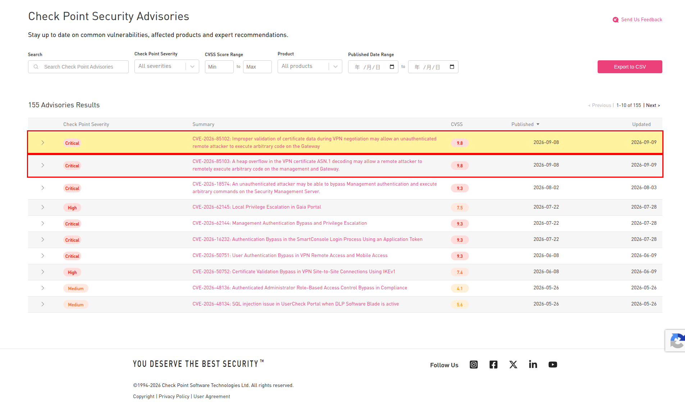
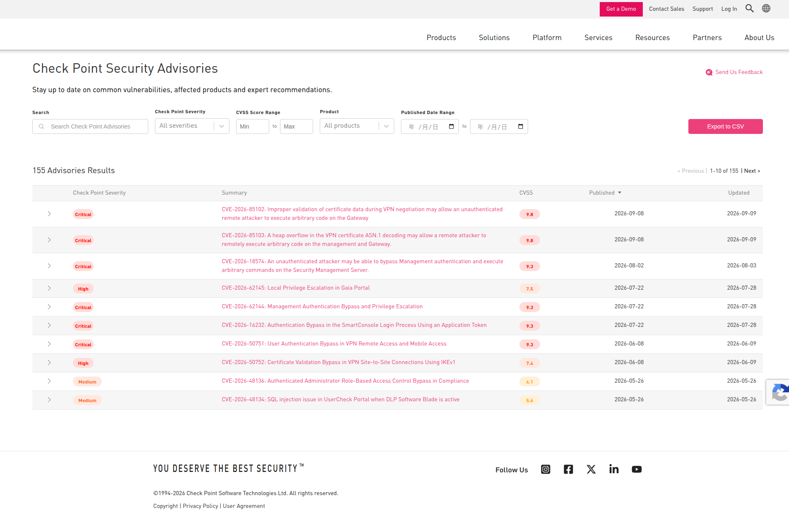
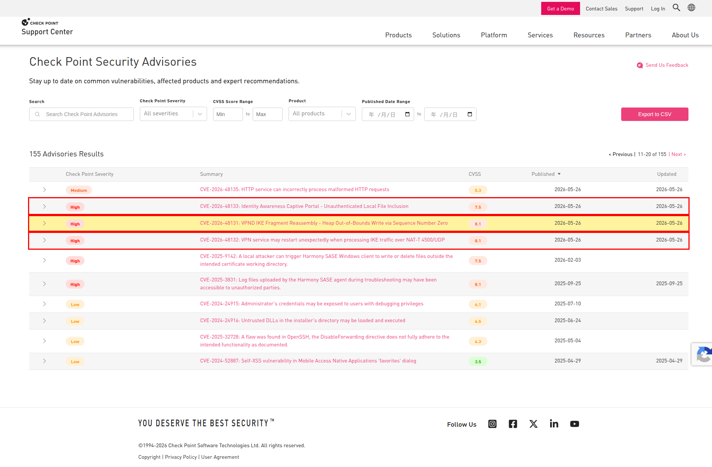

# checkpoint_CVE_crawler

自動幫你到 [Check Point 安全公告網站](https://support.checkpoint.com/security-advisories) 找出「最近幾天內、很危險」的漏洞（CVE）。

---

## 🧸 用最簡單的方式說明（ELI5）

想像 Check Point 網站是一面**公告欄**，上面貼滿了「哪裡有破洞要小心」的紙條，每張紙條都寫著：

- **危險程度**：Critical（超危險）、High（很危險）、Medium（普通）、Low（還好）
- **貼上去的日期**（Published）

每天自己去看公告欄很累，所以我們做了一個**小機器人**：

1. 機器人自己打開瀏覽器，走到公告欄前面。
2. 一張一張看紙條，只撿起「**超危險**或**很危險**」而且是「**最近 3 天或 7 天內**貼上去」的紙條。
3. 看到超過指定天數的舊紙條時，就知道後面都是更舊的，直接收工回家（因為公告欄會把新紙條貼在最前面）。
4. 把撿到的紙條念給你聽（印在畫面上），再抄一份到筆記本（CSV 檔）。

### 為什麼要「避開反爬蟲機制」？

有些網站不喜歡機器人來看，會想辦法把機器人趕走。所以我們的小機器人會**假裝成一般人**：

| 小機器人做的事 | 就像是… |
|---|---|
| 換掉瀏覽器的身分標籤（User-Agent） | 把「我是機器人」的名牌拿掉 |
| 隱藏 `navigator.webdriver` | 把「這是自動操作」的標記藏起來 |
| 翻頁前後隨機停一下 | 像真人一樣慢慢看，不會一秒翻十頁 |
| 打不開時等一下再試（最多 3 次，一次比一次等更久） | 敲門沒人應，過一會兒再敲，不會一直狂敲 |
| 用大螢幕尺寸開網頁 | 螢幕太小，網站會變成手機版，就看不到表格了 |

---

## 🛠️ 事前準備

你的電腦需要有這兩樣東西：

- **Python 3**（開發時使用 3.13）
- **Google Chrome 或 Chromium 瀏覽器**（小機器人要用它來開網頁）

### 🪟 Windows

1. **裝 Python**：到 [python.org/downloads](https://www.python.org/downloads/) 下載安裝檔，執行後
   **務必勾選最下面的 `Add python.exe to PATH`**（沒勾的話，命令提示字元會找不到 `python` 指令），
   再按 `Install Now`。
2. **裝 Google Chrome**：到 [google.com/chrome](https://www.google.com/chrome/) 下載安裝，用預設路徑即可。
3. **裝 Git**（想用 `git clone` 才需要）：到 [git-scm.com/download/win](https://git-scm.com/download/win) 下載安裝，全部按預設值就好。
   不想裝 Git 的話，也可以在 GitHub 專案頁按 `Code` → `Download ZIP`，下載後解壓縮。
4. **確認裝好了**：按 `Win + R`，輸入 `cmd` 後按 Enter，打開命令提示字元，輸入：
   ```cmd
   python --version
   ```
   有顯示版本號（例如 `Python 3.13.5`）就代表成功。
   如果顯示「找不到」或跳出 Microsoft Store，改用 `py --version` 試試看；兩個都不行就重裝並記得勾 PATH。

### 🐧 Linux / 🍎 macOS

```bash
python3 --version    # 有顯示版本號就代表裝好了
```

- macOS 建議用官方安裝檔或 Homebrew（`brew install python`）。
- **Ubuntu / Debian** 還要多裝一個套件，否則建立虛擬環境時會失敗：
  ```bash
  sudo apt install python3-venv
  ```
- Chrome 請到 [google.com/chrome](https://www.google.com/chrome/) 下載安裝。

## 📦 安裝（只要做一次）

### 🪟 Windows（命令提示字元 cmd）

```cmd
REM 1. 下載專案（用 ZIP 下載的話，改成 cd 到解壓縮後的資料夾）
git clone https://github.com/joe50304/checkpoint_CVE_crawler.git
cd checkpoint_CVE_crawler

REM 2. 建立虛擬環境（像是幫這個專案準備一個專屬的工具箱）
python -m venv .venv

REM 3. 打開工具箱
.venv\Scripts\activate

REM 4. 把需要的工具放進工具箱
pip install -r requirements.txt
```

> 💡 用 **PowerShell** 的人，第 3 步要改成 `.\.venv\Scripts\Activate.ps1`。
> 若出現「因為這個系統上已停用指令碼執行」的錯誤，先執行下面這行再試一次（只要做一次）：
> ```powershell
> Set-ExecutionPolicy -Scope CurrentUser RemoteSigned
> ```

### 🐧 Linux / 🍎 macOS

```bash
# 1. 下載專案
git clone https://github.com/joe50304/checkpoint_CVE_crawler.git
cd checkpoint_CVE_crawler

# 2. 建立虛擬環境（像是幫這個專案準備一個專屬的工具箱）
python3 -m venv .venv

# 3. 打開工具箱
source .venv/bin/activate

# 4. 把需要的工具放進工具箱
pip install -r requirements.txt
```

> 💡 看到命令列前面出現 `(.venv)`，就代表工具箱已經打開了。
> 用完想關掉，輸入 `deactivate` 即可（Windows 也是同一個指令）。

## ▶️ 開始使用

先確認工具箱有打開（Windows：`.venv\Scripts\activate`；Linux / macOS：`source .venv/bin/activate`），再執行：

```bash
# 抓最近 7 天的 Critical / High 漏洞（沒指定時預設就是 7 天）
python crawler.py --days 7

# 抓最近 3 天的
python crawler.py --days 3
```

### 所有參數

| 參數 | 用途 | 預設值 |
|---|---|---|
| `--days` | 要抓幾天內的公告，只能填 `3` 或 `7` | `7` |
| `--out` | CSV 檔要存在哪裡（相對路徑會以**你執行指令時所在的資料夾**為準） | `checkpoint_cve.csv` |
| `--shot` | 截圖檔名前綴，會存成 `<前綴>_p<頁數>.png`，符合條件的列會加上紅框 | 不截圖 |
| `--show` | 開啟看得到的瀏覽器視窗，可以親眼看機器人在做什麼 | 關閉（背景執行） |

### 範例：抓 7 天內的漏洞，順便截圖佐證

```bash
mkdir -p shots
python crawler.py --days 7 --out shots/cve_7d.csv --shot shots/days7
```

Windows（命令提示字元 cmd）：

```cmd
mkdir shots
python crawler.py --days 7 --out shots\cve_7d.csv --shot shots\days7
```

畫面會出現（`...` 開頭的是執行進度，讓你知道程式還在跑，沒有當掉）：

```
Looking for Critical/High advisories published in the last 7 day(s) ...
Opening browser (headless=True) ...
Loading https://support.checkpoint.com/security-advisories (attempt 1/3) ...
Page 1: 10 rows (2026-05-26~2026-09-08), 2 match(es), 2 total
Closing browser ...
Local date 2026-09-15 | cutoff 2026-09-08 (7 days) | 2 match(es)
2026-09-08  Critical CVSS 9.8  CVE-2026-85102   Improper validation of certificate data during VPN negotiation ...
2026-09-08  Critical CVSS 9.8  CVE-2026-85103   A heap overflow in the VPN certificate ASN.1 decoding ...
Saved shots/cve_7d.csv
```

- `Page 1: 10 rows ...`：目前看到第幾頁、這頁有幾筆、其中幾筆符合條件
- `Local date`：你電腦今天的日期
- `cutoff`：最早要抓到哪一天（今天減掉天數，當天也算在內）
- `match(es)`：總共抓到幾筆

> 💡 整個過程大約要花 10～60 秒（要等瀏覽器開啟、網頁載入，翻頁前後還會隨機停一下）。
> 只要進度訊息一直在動，就代表程式正常，不用中斷它。
> 一筆都沒找到時，CSV 仍然會產生，只是裡面只有標題列，畫面也會提示 `(no matching advisory, header only)`。

### ⚠️ 檔案會被覆蓋

每次執行都會**直接覆蓋**同名的 CSV，不會累積。想保留每天的紀錄，可以把日期加進檔名：

```bash
python crawler.py --days 7 --out cve_$(date +%F).csv
# 產生 cve_2026-09-16.csv，明天跑就是 cve_2026-09-17.csv
```

Windows PowerShell 的寫法：

```powershell
python crawler.py --days 7 --out "cve_$(Get-Date -Format yyyy-MM-dd).csv"
```

Windows 命令提示字元（cmd）的寫法：

```cmd
python crawler.py --days 7 --out "cve_%date:~0,4%-%date:~5,2%-%date:~8,2%.csv"
```

> ⚠️ cmd 的 `%date%` 格式會跟著系統的地區設定跑，日期不一定切得準。用 PowerShell 比較保險。

## 📄 輸出的 CSV 長什麼樣子

| 欄位 | 意思 |
|---|---|
| `cve` | 漏洞編號，例如 `CVE-2026-85102` |
| `severity` | Check Point 危險程度（Critical / High） |
| `cvss` | CVSS 分數，越高越危險（滿分 10） |
| `published` | 公告發布日期 |
| `updated` | 最後更新日期 |
| `summary` | 漏洞說明 |
| `link` | 官方公告的詳細網址 |

> CSV 使用 `UTF-8 with BOM` 編碼，直接用 Excel 開也不會變亂碼。

## 📸 驗證截圖

以下截圖是實際執行的結果（本機日期 2026-09-15），**紅框**就是小機器人撿到的紙條：

**最近 7 天**：抓到 2 筆 Critical



**最近 3 天**：沒有符合條件的公告（0 筆），畫面上沒有紅框



**跨頁測試**（抓 120 天內的資料）：第 2 頁的 3 筆 High 也有抓到，沒有重複



## ✅ 自我檢查

篩選規則（危險程度＋日期）有小測試，改程式後可以跑一下：

```bash
python test_crawler.py
# 印出 ok 就代表篩選規則正常
```

## ❓ 常見問題

**Q：出現 `ModuleNotFoundError: No module named 'DrissionPage'`？**
A：工具箱沒打開，或還沒安裝。先執行 `source .venv/bin/activate`，再執行 `pip install -r requirements.txt`。

**Q：出現 `advisory table not found (blocked or layout changed)`？**
A：小機器人敲了 3 次門都找不到表格。可能是網路不穩、被網站擋下來，或網站改版了。可以加上 `--show` 親眼看看瀏覽器畫面卡在哪裡。

**Q：為什麼 `--days` 只能填 3 或 7？**
A：這是依照需求設定的。如果想抓其他天數，把 `crawler.py` 裡 `choices=(3, 7)` 這一行改掉就可以了。

**Q：Windows 出現 `'python' 不是內部或外部命令`？**
A：安裝 Python 時沒有勾 `Add python.exe to PATH`。可以改用 `py` 開頭執行（例如 `py -m venv .venv`），或是重新執行安裝檔、選 `Modify` 補勾 PATH，然後**關掉命令提示字元再重開**。

**Q：Windows PowerShell 出現「因為這個系統上已停用指令碼執行」？**
A：PowerShell 預設擋住指令碼。執行 `Set-ExecutionPolicy -Scope CurrentUser RemoteSigned` 後再啟用一次虛擬環境；或者改用命令提示字元（cmd），輸入 `.venv\Scripts\activate` 就沒這個限制。

**Q：Ubuntu 出現 `ensurepip is not available`？**
A：少裝了虛擬環境套件。執行 `sudo apt install python3-venv` 後，再建立一次 `.venv`。

**Q：有沒有什麼限制？**
A：小機器人假設網站的公告是「**新的排在最前面**」，所以看到舊資料就提早收工。如果哪天網站改了排序方式，可能會漏抓。
